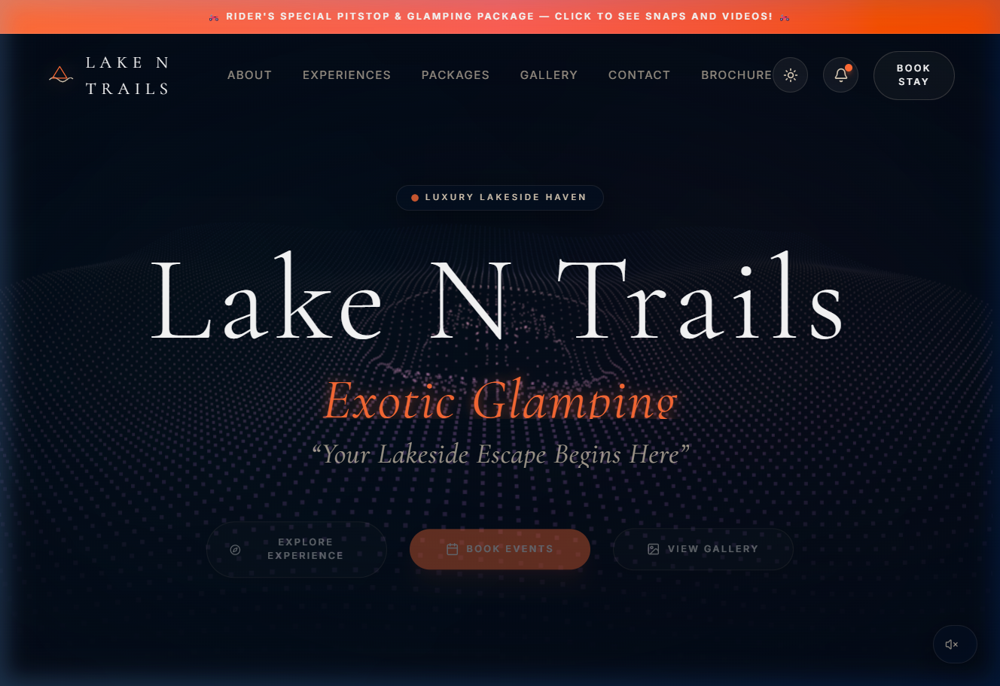
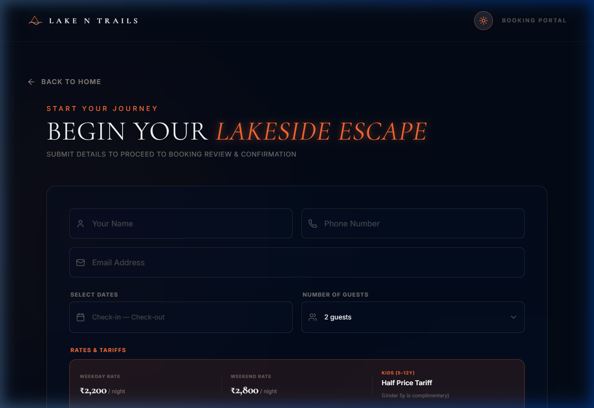
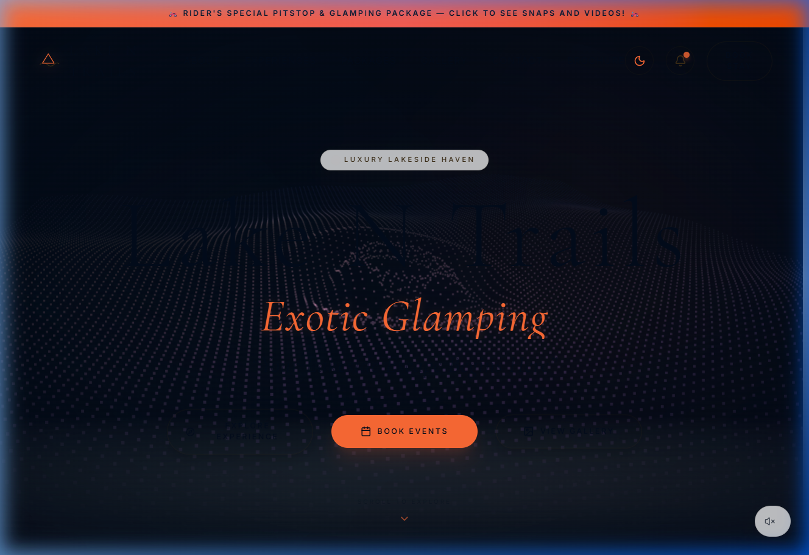

# 🌴 Lake N Trails Exotic Glamping

> **Escape Ordinary, Experience Exotic.** A premium, highly interactive portfolio web application built for the **Lake N Trails** luxury lakeside resort in Khopoli, Maharashtra.

🔗 **Live Website:** [https://lakentrails.in](https://lakentrails.in)  
💻 **Local Port Address:** [http://localhost:3000](http://localhost:3000)

---

## 📸 Site Previews

### 🌌 Homepage (Dark Vibe)


### 🎫 Interactive Booking Portal


### 🌓 Responsive Light/Dark Theme Modes


---

## ✨ Core Features

### 1. 🎬 Preloading Cinematic Screen
- A luxury Bali-inspired loading screen with modern, glowing brand intro animation that sets the stage for a premium guest experience before layout hydration.

### 2. 🎵 Dynamic Ambient Audio Controller
- A custom, persistent audio player positioned in the bottom corners of the page, streaming a relaxing background nature loop. It features smooth play/pause states and remembers volume preferences.

### 3. 🌗 Dual-Theme Architecture (Dark & Light)
- A highly polished, custom-tailored theme system that dynamically flips the layout from a rich, dark-blue night mode (optimized for stars and bonfires) to a bright, clean luxury day mode.
- Correctly synchronizes typography, borders, glassmorphism cards, and dropdown selections to ensure perfect readability.

### 4. 🏷️ Real-Time Smart Booking Portal (`/book`)
- An interactive, step-by-step guest booking wizard featuring:
  - Day Outing vs Stay Package selector.
  - Active date pickers identifying weekdays vs weekends.
  - Dynamic tariff calculations adjusting per person rates (Weekday Adult ₹1,500, Weekend Adult ₹1,800, Kids ₹700/₹800, Under 5 complimentary).
  - Special pet charge additions and event notes logging.
  - Summary checkout receipts rendering total subtotal, 5% resort tax addition, and total net pay.

### 5. 🖼️ Dynamic Media Lightbox Gallery
- Grid layout showcasing high-definition snaps and drone footage categorizable by photo, video, touring riders, or pet celebrations.
- Features a responsive fullscreen lightbox player with **z-index layering fixes**, preventing layout overlaps on vertical mobile screens.
- Prepends the official HD tour video with unmuted autoplaying audio, keeping secondary videos permanently muted.

### 6. 📢 Interactive Promo Banners & Notifications
- Custom header notifications alerting visitors about upcoming touring pitstops and dog parties. Clicking them auto-scrolls the page and dynamically filters the gallery to matching tags.

---

## 🛠️ Technical Architecture & Stack

- **Framework**: [Next.js](https://nextjs.org/) (App Router)
- **Language**: [TypeScript](https://www.typescriptlang.org/)
- **Animation**: [Framer Motion](https://www.framer.com/motion/) (micro-animations, spring offsets, smooth viewport reveals)
- **Styling**: [Tailwind CSS](https://tailwindcss.com/) (glassmorphism panels, tailored HSL color schemes)
- **Icons**: [Lucide React](https://lucide.dev/)
- **Scrolling**: [Lenis](https://lenis.darkroom.engineering/) (momentum-based smooth scrolling on desktop viewports)
- **Analytics**: [Vercel Analytics](https://vercel.com/analytics)

---

## 🚀 Getting Started & Local Development

### 1. Clone the repository and install dependencies
```bash
npm install
```

### 2. Launch the local hot-reload dev server
```bash
npm run dev
```
Open [http://localhost:3000](http://localhost:3000) on your local browser to interact with the site.

### 3. Build and compile production bundles
```bash
npm run build
```
Generates an optimized, statically compiled distribution ready for deployment.
